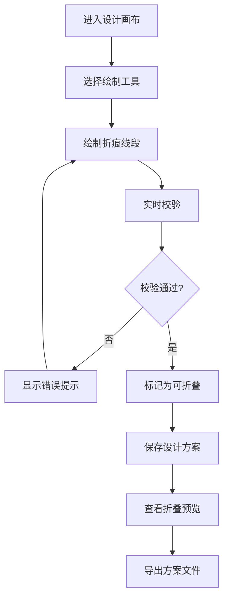

## 1. 产品概述

纸艺折痕展开图设计与校验系统，面向传统折纸/剪纸艺术家和手工爱好者，提供数字化的折痕设计、实时校验与折叠预览功能。

- 解决传统纸艺设计依赖手绘、难以校验折法正确性的痛点
- 通过数字化工具提升设计效率，降低新手入门门槛

## 2. 核心功能

### 2.1 用户角色

| 角色 | 使用方式 | 核心能力 |
|------|----------|----------|
| 设计师 | 网页直接使用 | 绘制折痕、校验方案、导出设计 |
| 爱好者 | 网页直接使用 | 浏览方案、学习折叠步骤 |

### 2.2 功能模块

1. **设计画布**：纸张边界、网格辅助、折痕绘制工具
2. **实时校验**：闭合检测、冲突检测、边界检测
3. **折叠预览**：步骤动画、3D 折叠效果
4. **方案管理**：保存方案、列表展示、复杂度对比
5. **对称轴管理**：对称轴设置、对称折痕联动

### 2.3 页面详情

| 页面名称 | 模块名称 | 功能描述 |
|-----------|-------------|---------------------|
| 主设计页 | 顶部工具栏 | 工具选择（山折/谷折/剪口/对称轴）、撤销重做、缩放平移 |
| 主设计页 | 左侧图层面板 | 线段列表、类型筛选、可见性控制 |
| 主设计页 | 中央画布 | SVG 画布、纸张边界、折痕渲染、交互绘制 |
| 主设计页 | 右侧校验面板 | 实时校验结果、错误列表、可折叠状态 |
| 主设计页 | 底部状态栏 | 当前工具、坐标显示、线段统计 |
| 方案管理页 | 方案列表 | 卡片式展示、复杂度对比、导入导出 |
| 折叠预览页 | 步骤预览 | 逐步折叠动画、步骤说明、速度控制 |

## 3. 核心流程

用户选择绘制工具 → 在画布上绘制折痕线段 → 系统实时校验折痕合法性 → 调整折痕直至所有校验通过 → 保存为设计方案 → 查看折叠步骤预览 → 导出方案文件

## 4. 用户界面设计

### 4.1 设计风格

- **主色调**：米白色纸张质感（#F5F0E6）搭配墨蓝色线条（#2C3E50），体现传统纸艺的温润质感
- **点缀色**：山折线用正红色（#C0392B）、谷折线用深蓝色（#2980B9）、剪口用深灰色（#555555）
- **按钮风格**：细边框圆角按钮，悬停时有轻微阴影和颜色变化
- **字体**：标题使用 Lora 衬线体，正文使用 Source Sans Pro，营造工艺感
- **布局风格**：三栏式专业设计工具布局，中央画布为视觉重心
- **图标风格**：线性图标，简洁克制

### 4.2 页面设计概述

| 页面名称 | 模块名称 | UI 元素 |
|-----------|-------------|----------|
| 主设计页 | 顶部工具栏 | 工具按钮组、分隔线、操作按钮、下拉菜单 |
| 主设计页 | 左侧图层面板 | 可折叠面板、线段列表、类型标签、眼睛图标 |
| 主设计页 | 中央画布 | 纸张阴影效果、网格辅助线、折痕悬停高亮 |
| 主设计页 | 右侧校验面板 | 状态指示卡片、错误列表、修复建议 |
| 主设计页 | 底部状态栏 | 左对齐状态信息、右对齐统计数据 |
| 方案管理页 | 方案列表 | 卡片网格、悬浮效果、复杂度进度条 |
| 折叠预览页 | 预览区域 | 大尺寸画布、步骤进度条、播放控制 |

### 4.3 响应式

桌面端优先，平板适配（折叠侧面板），移动端保留核心画布功能。

### 4.4 动画效果

- 折痕绘制时有渐入动画
- 校验错误出现时有轻微抖动提示
- 折叠预览有平滑过渡动画
- 面板展开/收起有过渡动效
