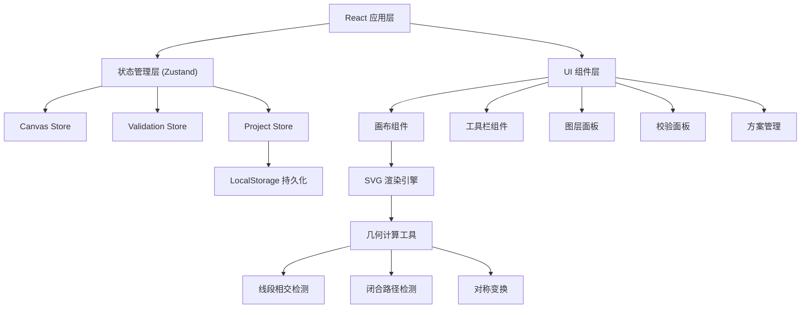

## 1. 架构设计



## 2. 技术描述

- **前端框架**：React@18 + TypeScript
- **构建工具**：Vite
- **样式方案**：TailwindCSS@3
- **状态管理**：Zustand
- **图标库**：Lucide React
- **路由**：React Router
- **几何计算**：自研工具函数（线段相交、闭合检测、对称变换）
- **数据持久化**：LocalStorage

## 3. 路由定义

| 路由 | 用途 |
|-------|---------|
| / | 主设计画布页 |
| /projects | 方案管理页 |
| /preview/:id | 折叠预览页 |

## 4. 数据模型

### 4.1 核心类型定义

```typescript
// 折痕类型
type LineType = 'mountain' | 'valley' | 'cut' | 'axis' | 'support';

// 点
interface Point {
  x: number;
  y: number;
}

// 线段
interface LineSegment {
  id: string;
  type: LineType;
  start: Point;
  end: Point;
  visible: boolean;
  order: number;
}

// 纸张
interface Paper {
  width: number;
  height: number;
  origin: Point;
}

// 校验错误
interface ValidationError {
  id: string;
  type: 'boundary' | 'conflict' | 'uncosed' | 'support_cut' | 'symmetry';
  message: string;
  lineIds: string[];
  severity: 'error' | 'warning';
}

// 设计方案
interface Project {
  id: string;
  name: string;
  createdAt: number;
  updatedAt: number;
  paper: Paper;
  lines: LineSegment[];
  isFoldable: boolean;
  complexity: number;
  foldSteps: FoldStep[];
}

// 折叠步骤
interface FoldStep {
  step: number;
  description: string;
  lineIds: string[];
  foldAngle: number;
}
```

### 4.2 复杂度计算

复杂度基于以下因素加权计算：
- 山折线数量 × 2
- 谷折线数量 × 2
- 剪口数量 × 1
- 对称轴数量 × 3
- 闭合区域数量 × 1.5

## 5. 核心校验逻辑

### 5.1 边界检测
- 检查所有线段的端点是否在纸张边界内
- 线段不能超出纸张边缘

### 5.2 冲突检测
- 同一位置的线段不能同时标记为山折和谷折
- 使用线段相交算法检测交叉冲突

### 5.3 剪口检测
- 剪口不能穿过关键支撑线
- 剪口端点必须在纸张边缘或与其他剪口相连

### 5.4 闭合检测
- 使用图论算法检测所有折痕是否形成闭合结构
- 未闭合结构不能标记为可折叠

### 5.5 对称轴校验
- 修改对称轴后，相关对称折痕需要重新计算位置
- 检查对称线段的类型一致性

## 6. 项目结构

```
src/
├── components/
│   ├── canvas/
│   │   ├── DesignCanvas.tsx
│   │   ├── PaperLayer.tsx
│   │   ├── LineRenderer.tsx
│   │   └── GridHelper.tsx
│   ├── toolbar/
│   │   ├── Toolbar.tsx
│   │   ├── ToolButton.tsx
│   │   └── ZoomControls.tsx
│   ├── panels/
│   │   ├── LayerPanel.tsx
│   │   └── ValidationPanel.tsx
│   ├── projects/
│   │   ├── ProjectList.tsx
│   │   └── ProjectCard.tsx
│   └── preview/
│       ├── FoldPreview.tsx
│       └── StepController.tsx
├── store/
│   ├── canvasStore.ts
│   ├── validationStore.ts
│   └── projectStore.ts
├── utils/
│   ├── geometry.ts
│   ├── validation.ts
│   ├── foldSteps.ts
│   └── complexity.ts
├── types/
│   └── index.ts
├── hooks/
│   ├── useCanvasInteraction.ts
│   └── useValidation.ts
├── pages/
│   ├── DesignPage.tsx
│   ├── ProjectsPage.tsx
│   └── PreviewPage.tsx
├── App.tsx
├── main.tsx
└── index.css
```
